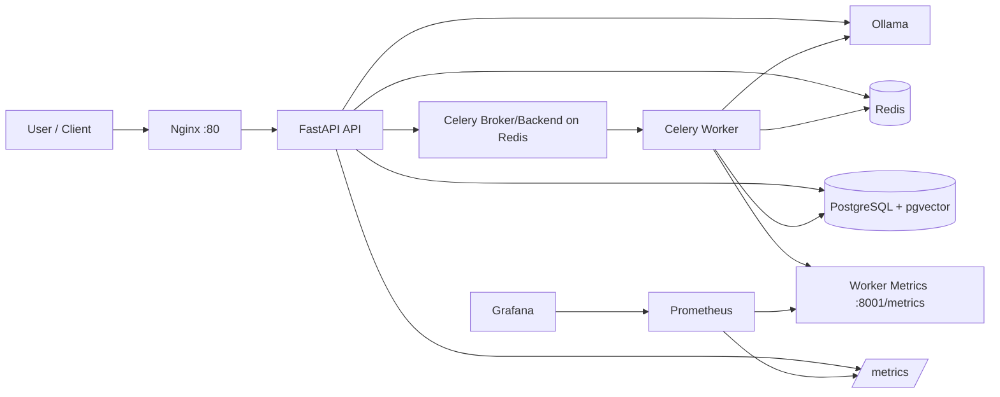
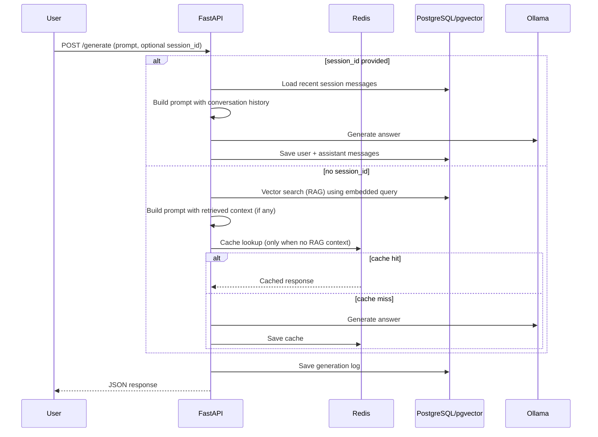

# Simple LLM Deployment (LLMOps Learning Project)

A production-style LLMOps project built step-by-step with FastAPI, Celery, Redis, PostgreSQL/pgvector, Ollama, Nginx, Prometheus, and Grafana.

This README documents what is implemented so far, how the system works, and how to run it (including manual model installation, since model-puller is disabled).

## Architecture
<p align="center">
  
</p>


## Architecture Workflow

```mermaid
graph LR
    subgraph Client Layer [Client Layer]
        External_App[External User Application]:::client
    end

    subgraph Infrastructure_Compose [Infrastructure (Docker Compose)]
        direction TB

        subgraph Observability [Observability Stack]
            direction RL
            Prometheus[Metrics Collector (Prometheus)]:::monitoring
            Grafana[Dashboard (Grafana)]:::monitoring
        end

        subgraph Proxy_Layer [API & Reverse Proxy Layer]
            direction TB
            Nginx[Reverse Proxy (Nginx)]:::compute
            FastAPI[LLM API Service (FastAPI)]:::compute
        end

        subgraph Queue_Layer [Queue Layer]
            RedisBroker[Message Broker (Redis)]:::datastore
        end

        subgraph Processing_Layer [Async Processing Layer]
            CeleryWorker[LLM Worker (Celery)]:::compute
        end

        subgraph Model_Layer [Inference Layer]
            Ollama[Inference Service (Ollama)]:::inference
        end

        subgraph Data_Layer [Data & State Layer]
            RedisCache[Response Cache (Redis)]:::datastore
            PostgreSQL[Metadata DB (PostgreSQL)]:::datastore
        end

    end

    subgraph CICD [CI/CD Pipeline]
        GitHubActions[CI/CD Workflow (GitHub Actions)]:::cicd
        ContainerRegistry[Container Registry]:::cicd
    end

    %% -- Connections --
    %% 1. CI/CD Flow
    GitHubActions -->|Build & Push Images| ContainerRegistry
    ContainerRegistry -->|Deploy (docker compose pull)| Infrastructure_Compose

    %% 2. External Traffic (Sync)
    External_App -->|HTTPS Request (API Key)| Nginx
    Nginx -->|HTTP Proxy| FastAPI
    
    %% 3. API - Database (Sync)
    FastAPI -->|Store Metadata (Prompts/Responses)| PostgreSQL

    %% 4. API - Caching (Sync Request/Response)
    FastAPI -.->|Check/Set Cache| RedisCache

    %% 5. Async Workflow
    FastAPI -->|Enqueue Async Job| RedisBroker:::sync_traffic
    RedisBroker -->|Consume Job| CeleryWorker:::async_traffic
    CeleryWorker -->|Inference Request (e.g., /api/chat)| Ollama
    Ollama -->|Generate Response| CeleryWorker
    CeleryWorker -->|Update Status/Results| PostgreSQL

    %% 6. (Optional) Ollama Model Volume
    %% Ollama -->|Mounts /root/.ollama| ModelVolume

    %% 7. Observability (Pull/Scrape Metrics)
    Prometheus -->|Scrape Metrics (/metrics)| Nginx
    Prometheus -->|Scrape Metrics (/metrics)| FastAPI
    Prometheus -->|Scrape Metrics (/metrics)| CeleryWorker
    Prometheus -->|Scrape Metrics (/api/stats)| Ollama
    Grafana -->|Query Metrics| Prometheus

    %% --- Optional Kubernetes Dotted Boundary ---
    linkStyle 0,1,2,3,4,5,6,7,8,9,10,11,12,13,14,15,16,17,18,19 stroke-width:2px;

    classDef client fill:#f9f,stroke:#333,stroke-width:2px,rx:5,ry:5;
    classDef compute fill:#bbf,stroke:#333,stroke-width:2px,rx:5,ry:5;
    classDef datastore fill:#dfd,stroke:#333,stroke-width:2px,rx:5,ry:5;
    classDef inference fill:#fbd,stroke:#333,stroke-width:2px,stroke-dasharray: 5 5,rx:5,ry:5;
    classDef cicd fill:#ffb,stroke:#333,stroke-width:2px,stroke-dasharray: 5 5,rx:5,ry:5;
    classDef monitoring fill:#fdb,stroke:#333,stroke-width:1px,stroke-dasharray: 5 5,rx:5,ry:5;
    
    classDef sync_traffic stroke:#0c0,stroke-width:2px;
    classDef async_traffic stroke:#00c,stroke-width:2px;

    %% Add Legend (conceptual)
    %% Note[Legend: \n Green Arrow: Sync Request/Response \n Blue Arrow: Async Job Flow]:::legend
```

## What Has Been Implemented?

### 1) API Hardening
- API key authentication (`X-API-Key` header)
- Request validation with Pydantic models
- In-memory rate limiting per API key

### 2) Async Processing
- Redis-backed Celery queue
- Async endpoints:
  - `POST /submit`
  - `GET /result/{task_id}`

### 3) Caching Layer
- Redis prompt-response cache for synchronous requests
- TTL-based entries and SHA-256 prompt keying

### 4) Persistent Storage
- PostgreSQL logging of generations
- Stored fields include:
  - prompt
  - full model response
  - latency
  - timestamp

### 5) Advanced Observability
- API metrics exposed at `/metrics`
- Worker metrics exposed at port `8001` (`/metrics`)
- Prometheus scrapes API + worker
- Grafana datasource + dashboards provisioned from local files

### 6) Conversation Memory
- Session memory stored in PostgreSQL (`session_messages`)
- Optional `session_id` in `/generate` and `/submit`
- Previous conversation turns are injected into prompt construction

### 7) RAG (Retrieval-Augmented Generation)
- Embeddings via Ollama embedding model (`OLLAMA_EMBED_MODEL`)
- pgvector storage (`rag_chunks` table)
- Ingestion endpoint: `POST /ingest`
- Retrieval before generation for non-session requests

## Simple Architecture



## Request Flow (Sync + RAG + Session)



## Project Structure

- `docker-compose.yml` - full stack orchestration
- `api/` - FastAPI app + worker code
- `api/src/app_factory.py` - routes and dependency wiring
- `api/src/services.py` - generation, session memory, and RAG service logic
- `api/src/storage.py` - PostgreSQL + pgvector persistence
- `api/src/tasks.py` - Celery task execution path
- `prometheus.yml` - Prometheus scrape config
- `grafana/` - provisioning for datasource and dashboards
- `run.sh` - quick local prompt runner (prints only response text)

## Prerequisites

- Docker + Docker Compose
- Bash shell (for `run.sh`)

## Environment Setup

1. Copy env file:

```bash
cp .env.example .env
```

2. Update required values in `.env`:
- `API_KEY`
- `OLLAMA_MODEL`
- `OLLAMA_EMBED_MODEL`

Defaults already exist for local development.

## Start the Stack

```bash
docker compose up --build -d
```

Check status:

```bash
docker compose ps
```

## Install Models Manually (Important)

Model-puller is disabled currently, so install models manually after containers are up:

```bash
docker exec ollama ollama pull tinyllama
docker exec ollama ollama pull nomic-embed-text
```

Use your `.env` values if you changed model names.

Verify installed models:

```bash
docker exec ollama ollama list
```

## Run and Test

### Health

```bash
curl -s http://localhost/
```

### Sync generation

```bash
curl -s -X POST http://localhost/generate \
  -H "Content-Type: application/json" \
  -H "X-API-Key: adminLLM" \
  --data-raw '{"prompt":"Is apple healthy?"}'
```

### Quick runner script

```bash
./run.sh "Is apple healthy?"
```

### Async generation

```bash
curl -s -X POST http://localhost/submit \
  -H "Content-Type: application/json" \
  -H "X-API-Key: adminLLM" \
  --data-raw '{"prompt":"Explain caching in one paragraph"}'
```

Use returned `task_id`:

```bash
curl -s -H "X-API-Key: adminLLM" http://localhost/result/<task_id>
```

### Session memory test

```bash
curl -s -X POST http://localhost/generate \
  -H "Content-Type: application/json" \
  -H "X-API-Key: adminLLM" \
  --data-raw '{"prompt":"My name is Alex","session_id":"demo-1"}'

curl -s -X POST http://localhost/generate \
  -H "Content-Type: application/json" \
  -H "X-API-Key: adminLLM" \
  --data-raw '{"prompt":"What is my name?","session_id":"demo-1"}'
```

### RAG ingest + query

Ingest knowledge:

```bash
curl -s -X POST http://localhost/ingest \
  -H "Content-Type: application/json" \
  -H "X-API-Key: adminLLM" \
  --data-raw '{"text":"Apples are rich in fiber and vitamin C.","source":"notes"}'
```

Ask related question:

```bash
./run.sh "Are apples healthy?"
```

## Observability

- API metrics: `http://localhost/metrics`
- Prometheus: `http://localhost:9090`
- Grafana: `http://localhost:3000`

Note: If Grafana login seems stale, reset persistent data once:

```bash
docker compose down -v
docker compose up --build -d
```

## Database Checks

### List tables

```bash
docker compose exec postgres psql -U llmops -d llmops -c "\dt"
```

### Generation logs

```bash
docker compose exec postgres psql -U llmops -d llmops -c "SELECT COUNT(*) AS total_logs FROM llm_logs;"
```

### Session messages

```bash
docker compose exec postgres psql -U llmops -d llmops -c "SELECT COUNT(*) AS total_session_messages FROM session_messages;"
```

### RAG chunks

```bash
docker compose exec postgres psql -U llmops -d llmops -c "SELECT id, source, left(content, 120) AS content_preview FROM rag_chunks ORDER BY id DESC LIMIT 20;"
```

## Notes and Current Limitations

- Model auto-pulling is intentionally disabled for now.
- RAG chunking is simple sentence/length based (good for learning, not yet advanced document parsing).
- Rate limiter is in-memory (single-node dev setup behavior).

## Next Roadmap Items (Not Yet Implemented)

From your plan, these are still pending:
- 8) React (UI)
- 9) CI/CD Pipelines (GitHub Actions)
- 10) Model Abstraction Layer
- 11) Kubernetes Deployment
- 12) Costing & Tracking
- 13) Deployment